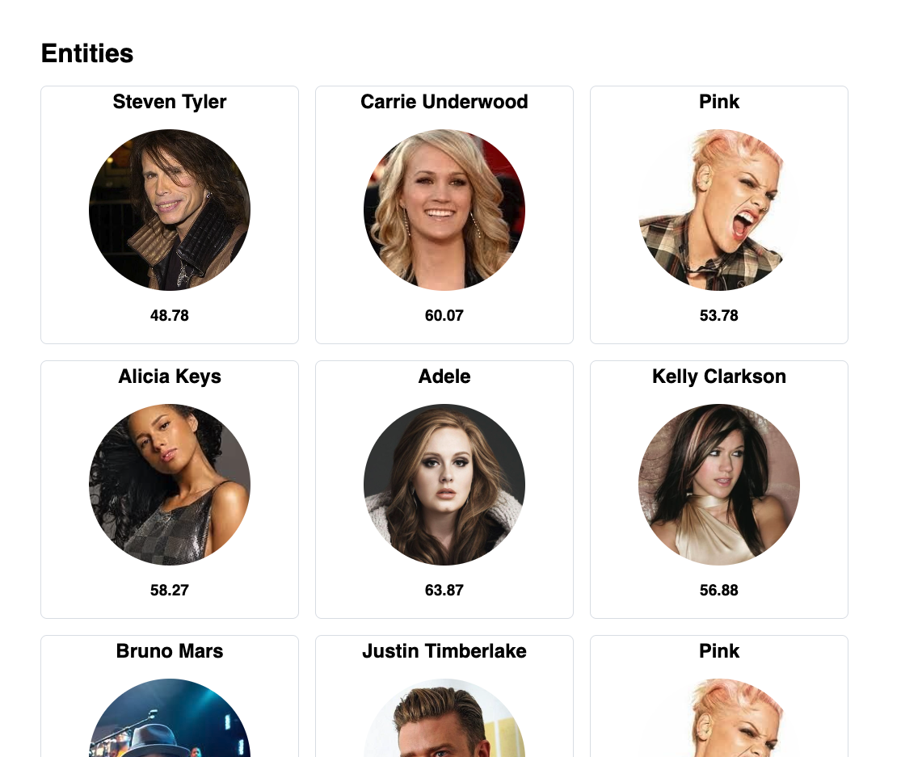
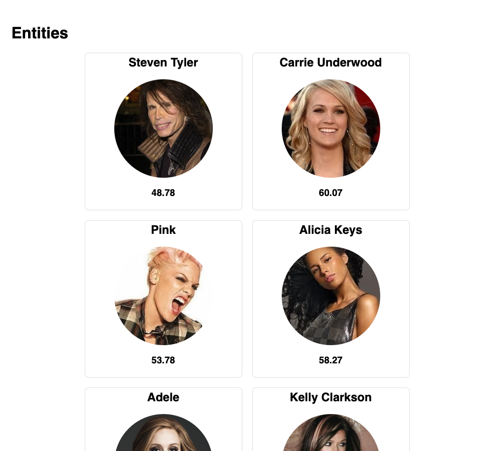
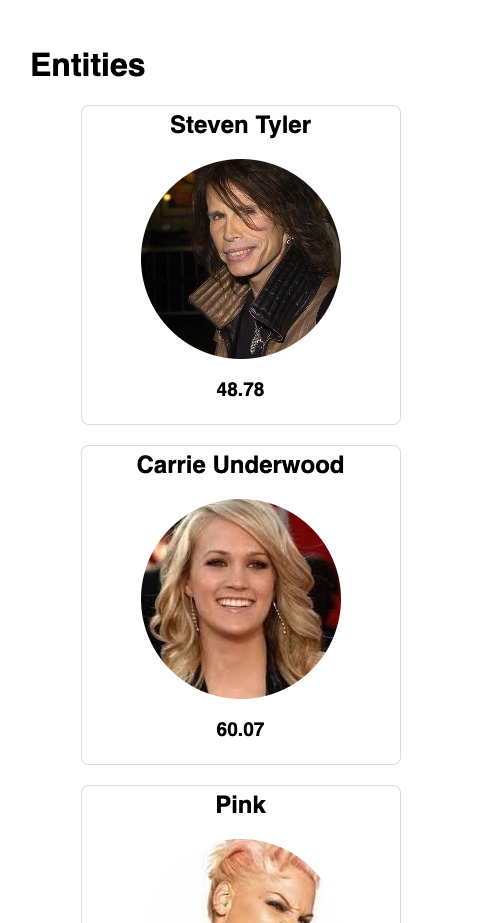

# Setup
-  Install the newest version of Node.js
- run `npm install` to install all dependencies

# Starting application
- run `npm run start`, application should be available under `http://localhost:1234`


# Task 1
When you launch the application you will see a list of 15 entities alongside their ratings. Please notice that some are being displayed more than once.

In `index.ts` file write a function `filterEntities` which will:
1. returns a list of unique entities
2. ratings value of which is greater than 50
3. sorted in descending order by the rating

Furthermore each rating value should be rounded to the nearest integer. 

Example:

Given entities:

```js
[
  {
    image: '',
    name: 'Steven Tyler',
    type: 'Music Artist',
    rating: 58.78,
    uuid: 'caefc890-c034-11e1-939f-005056a8759d',
  },
  {
    image: '',
    name: 'Carrie Underwood',
    type: 'Music Artist',
    rating: 60.07,
    uuid: 'bc9a55e1-a904-11e1-9412-005056900141',
  },
  {
    image: '',
    name: 'Steven Tyler',
    type: 'Music Artist',
    rating: 58.78,
    uuid: 'caefc890-c034-11e1-939f-005056a8759d',
  },
  {
    image: '',
    name: 'Michael Jackson',
    type: 'Music Artist',
    rating: 48.78,
    uuid: 'caefc890-c034-11e1-939f-005056a8759r',
  },
]
```

Result:
```js
[
  {
    image: '',
    name: 'Carrie Underwood',
    type: 'Music Artist',
    rating: 60,
    uuid: 'bc9a55e1-a904-11e1-9412-005056900141',
  },
  {
    image: '',
    name: 'Steven Tyler',
    type: 'Music Artist',
    rating: 59,
    uuid: 'caefc890-c034-11e1-939f-005056a8759d',
  },
]
```

## Remarks
- You can't use any libraries like `lodash`, everything needs to be written with usage of plain JS functions

# Task 2
In the `index.scss` file, create a `.grid` class that organizes elements into a grid layout with `20px` gaps. Ensure the grid is centered and responsive, adjusting seamlessly to different screen sizes.
 
## Examples:

### Desktop:


### Tablet:


### Mobile:




## Good luck! :)
